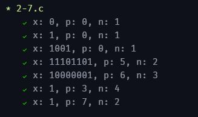
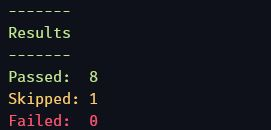

# k-and-r-solutions

This repository features solutions to the exercises of the book [The C Programming Language](https://www.goodreads.com/book/show/515601.The_C_Programming_Language), by Brian W. Kernighan and Dennis M. Ritchie (**K & R**).

## Running the exercises

```bash
# All exercises
./run.sh

# Exercises in a specific chapter
./run.sh 1

# Specific exercise, eg 1-5
./run.sh 1 5
```

Each exercise features a docblock at its top, featuring:

- The `@description` of the exercise
- For some exercises: an `@interactive` annotation

Interactive exercises will be skipped when running multiple exercises at once (eg all exercises in a chapter). Non-interactive exercises usually feature automated tests that check their correctness, for example:

- Single exercise results<br/>
  

- Multiple exercises result summary<br/>
  

**Hint:** for interactive exercises, press **Ctrl + D** to write `EOF` in the terminal (Linux). In K & R exercises, this is used as a signal that user input has finished.

## List of not (yet) implemented exercises

- 1-23
- 1-24
- 2-1
- 4-5
- 4-6
- 4-7
- 4-8
- 4-9
- 4-10
- 4-11
